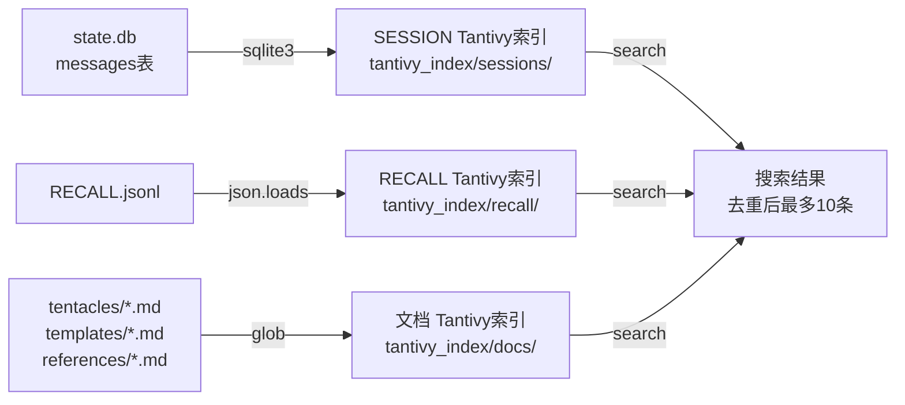

# 章鱼搜索v3.1三路搜索引擎 技术文档

> 作者：军师 · 日期：2026-06-28 · 关键词：章鱼, octopus, Tantivy, jieba, 三路搜索, SESSION, RECALL, 触须文档, state.db

## 概述

章鱼是Agent的本地搜索引擎，负责从所有记忆源中检索与当前对话相关的历史信息。**v3.1核心变更**：SESSION对话原文索引，从两路(摘要+文档)升级为三路(对话原文+摘要+文档)。

## 架构

### 三路搜索（按优先级排列）

```
用户输入"搜索词"
  │
  ├─ ① SESSION对话原文 ──── state.db messages ──── Tantivy索引
  │   （第一优先级：搜索14万+条完整对话记录）
  │
  ├─ ② RECALL事件摘要 ──── RECALL.jsonl ──── Tantivy索引
  │   （第二优先级：搜索结构化事件日志）
  │
  ├─ ③ 触须文档 ────────── tentacles/*.md ──── Tantivy索引
  │   （第三优先级：搜索技术文档、备忘录、执行报告等）
  │
  └─ ④ 文件名搜索 ──────── find 命令 ───────── 字符匹配
      （兜底：按文件名匹配项目文件）
```

### 数据流（全量索引）



## 文件

| 文件 | 职责 | 行数 | 变更 |
|------|------|------|------|
| `octopus_index.py` | 全量索引构建 | 250 | +SESSION索引 |
| `octopus_search.py` | 三路搜索引擎 | 213 | +search_sessions() |
| `octopus_index_incremental.py` | 增量索引（每5min） | 244 | +index_new_sessions() |
| `~/.hermes/plugins/jika/__init__.py` | Hermes插件集成 | 393 | 更新铁律+输出格式 |
| `octopus_index_sessions.sh` | cron脚本 | 5 | 新建 |

## SESSION索引Schema

```python
Tantivy Schema: sessions
┌─ id         (text, stored)  ← message_id（消息行号）
├─ session_id (text, stored)  ← 所属会话ID
├─ role       (text, stored)  ← user / assistant / tool
├─ body       (text, stored)  ← 结巴分词后的对话原文（截断2000字）
└─ ts        (integer, stored) ← Unix时间戳（排序用）
```

## 索引数据量

| 索引通道 | 条目数 | 数据源 | 文件大小 |
|---------|--------|--------|---------|
| SESSION | 145,599 条 | state.db messages表 | 3.3GB |
| RECALL | ~114 条 | RECALL.jsonl | ~50KB |
| 文档 | 36 篇 | tentacles/templates/references | ~2MB |

## 命令行用法

```bash
# 全量重建索引（重建后删除旧索引目录）
python3 octopus_index.py rebuild

# 增量索引（新消息自动追加，cron每5min运行）
python3 octopus_index_incremental.py

# 搜索
python3 octopus_search.py "关键词"

# 只搜最后N行增量（调试用）
python3 octopus_index_incremental.py --last-n 5
```

## 关键技术决策

| 决策 | 选择 | 理由 |
|------|------|------|
| 搜索引擎 | Tantivy | Rust原生，中文分词好，比SQLite FTS5快 |
| 中文分词 | jieba | 最简方案，零配置，tentacles已有 |
| 索引优先 | 1.SESSION 2.RECALL 3.文档 | SESSION含完整对话，信息密度最高 |
| 增量频率 | 每5分钟 cron | 防频繁写锁，平衡实时性 |
| 内容截断 | 2000字符 | 防tool output超长文本撑爆索引 |
| heap_size | 128MB | 全量索引14万条一次性提交 |

## 降级安全

| 场景 | 处理 |
|------|------|
| state.db不存在 | 返回0，不报错 |
| Tantivy索引不存在 | 返回空[]，不抛异常 |
| 空查询 | 提示用法，退出 |
| 无匹配 | 输出"无结果。" |
| 分词异常 | jieba内部处理，不抛出 |
| 超时(5s) | plugin alarm timeout，静默降级 |

## 结论

章鱼v3.1完成从"两路(摘要+文档)"到"三路(SESSION+摘要+文档)"的架构升级。核心变化：SESSION对话原文首次纳入索引，14万+条完整对话可搜索。这是章鱼回归其创造初心的关键修复——它是session搜索引擎，不是文档搜索引擎。

## 常见问题

### Q：SESSION索引是否包含tool输出？

A：包含。v3.1同时索引 `user`、`assistant`、`tool` 三种角色。tool输出中有代码执行结果和API返回，对搜索有辅助价值。

### Q：增量索引会重复索引吗？

A：不会。`.index_state.json` 追踪 `last_session_id`，增量只索引 `WHERE id > last_session_id` 的新消息。

### Q：全量重建后增量索引会重复吗？

A：全量重建后自动同步 `last_session_id` 到 state.db 的 `MAX(id)`，增量索引知道全部已索引。

## 相关文件

- `~/projects/isa/octopus/octopus_index.py` — 全量索引构建器
- `~/projects/isa/octopus/octopus_search.py` — 三路搜索引擎
- `~/projects/isa/octopus/octopus_index_incremental.py` — 增量索引
- `~/.hermes/plugins/jika/__init__.py` — Hermes插件（章鱼调用入口）
- `~/.hermes/scripts/octopus_index_sessions.sh` — cron wrapper脚本
- `~/projects/isa/octopus/.index_state.json` — 增量状态文件
- `/home/zcs/projects/isa/octopus/tentacles/techdoc/2026-06-25_techdoc_章鱼八触须写作输出标准.md` — 八触须写作标准

---

**版本：v3.1 · 更新日期：2026-06-28 · 签核：军师**

**变更历史**
| 版本 | 日期 | 变更 |
|------|------|------|
| v3.1 | 2026-06-28 | +SESSION对话原文索引（三路），增量索引，cron，铁律更新 |
| v3.0 | 2026-06-27 | Tantivy替换FTS5，jieba中文分词 |
